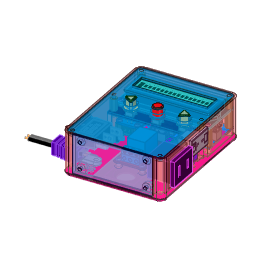

# ThermoStat-AC100V

Arduino Pro Micro (5V / ATmega32U4) と K型熱電対アンプモジュール（MAX31855）を用いた、AC100V機器（ヒーター・電熱線等）向けの温度調節器（サーモスタット）です。

AC-DCコンバータを内蔵しており、商用AC100V電源コードを接続するだけで内部回路および接続した負荷機器へ一括給電・制御が可能なスタンドアロン設計となっています。

<p align="center">
  
</p>

---

## 主な特徴

- **スタンドアロン構造**: AC100V電源入力を内部で分岐し、内蔵AC-DCコンバータからマイコン・センサ・LCDへ+5Vを供給。
- **ヒステリシス温調（2値制御）**:
  - 設定下限値（LO）を下回るとリレーON（加熱開始）
  - 設定上限値（HI）を上回るとリレーOFF（加熱停止）
  - 目標範囲内（LO〜HI）では前回の状態を維持し、頻繁なON/OFFチャタリングを防止。
- **不揮発メモリ（EEPROM）保持**: 設定したLO/HI温度は内蔵EEPROMに記録され、電源を切っても保持。
- **安全保護機能**:
  - 15A管ヒューズによる過電流保護
  - 電源スイッチおよび通電確認用パイロットランプ
  - MAX31855の自己診断機能による熱電対のオープン（断線）、GND短絡、VCC短絡の検出
  - 異常検知時のリレー即時強制遮断
- **カスタムキャラクタLCD表示**: 1602 I2C 液晶上に白黒反転文字（IDL, ACT, SET, ERR, ON, OFF）や度記号（°C）を描画し、状態を分かりやすく表示。
- **多機能ボタンスイッチ制御**: `VersatileSwitch` ライブラリを採用し、短押し・長押し・リピート（押しっぱなしでの連続増減）を排他制御付きで安全に処理。

---

## ハードウェア仕様

### 主要部品一覧

| 品名 / モジュール | 仕様・型番例 | 備考 |
|---|---|---|
| マイコンボード | Arduino Pro Micro 互換機 (5V / 16MHz, Type-C) | ATmega32U4 搭載 |
| 温度センサアンプ | Adafruit MAX31855 モジュール | K型熱電対用 (SPI通信) |
| 温度センサ | K型熱電対 | |
| 液晶ディスプレイ | 1602 I2C キャラクターLCD (16文字×2行) | デフォルトI2Cアドレス: `0x27` |
| リレーモジュール | 1ch リレーモジュール (Active-High) | 定格 125V / 15A |
| 電源モジュール | AC-DCコンバータモジュール | 入力: AC 100〜250V、出力: DC +5V 700mA |
| スイッチ | ロッカースイッチ | 125V / 15A |
| ヒューズ | ガラス管ヒューズ ＋ ソケット | 125V / 15A |
| パイロットランプ | ネオンランプ (PL) | AC100V 通電表示 |
| コンセント | 埋込型 ACアウトレット | 負荷（ヒーター等）接続用 |
| 操作スイッチ | タクトスイッチ × 3 | NEG (-), ACT (決定/動作), POS (+) |

### ピンアサイン（v2回路図準拠）

| 信号名 | ピン番号 (Arduino) | マイコン端子 | 接続先・用途 | 備考 |
|---|---|---|---|---|
| `PIN_SW_NEG` | **D7** | PE6 | NEG（-）タクトスイッチ | 値減少 / LO選択 |
| `PIN_SW_ACT` | **D8** | PB4 | ACT（決定）タクトスイッチ | 運転切替 / 設定モード切替 |
| `PIN_SW_POS` | **D9** | PB5 | POS（+）タクトスイッチ | 値増加 / HI選択 |
| `PIN_RELAY` | **D10** | PB6 | リレーモジュール `IN` | HIGH: リレーON / LOW: リレーOFF |
| `MAXCS` | **18 (A0)** | PF7 | MAX31855 `CS` | SPI チップセレクト |
| SPI SCLK | **D15** | PB1 (SCK) | MAX31855 `CLK` | ハードウェアSPI |
| SPI MISO | **D14** | PB3 (MISO) | MAX31855 `DO` | ハードウェアSPI |
| I2C SDA | **D2** | PD1 (SDA) | I2C LCD `SDA` | ハードウェアI2C |
| I2C SCL | **D3** | PD0 (SCL) | I2C LCD `SCL` | ハードウェアI2C |

※各スイッチの反対側端子は GND に接続されています。

---

## 画面表示と操作方法

### LCD表示フォーマット

```text
1行目: [STATE] +XX.X°C [RLY]   (例: IDL  +24.5°C  OFF)
2行目: [L +XX][H +XX]          (例: [L +50][H +65])
```

- **STATE**: 動作状態（`IDL`: 待機 / `ACT`: 運転中 / `SET`: 設定中 / `ERR`: エラー）
- **現在温度**: MAX31855から取得した現在温度（°C）
- **RLY**: リレー状態（`OFF`: 遮断 / `ON`: 通電）
- **L**: 下限目標温度（これ未満になるとリレーON）
- **H**: 上限目標温度（これを超えるとリレーOFF）

---

### モード遷移と操作手順

#### 1. 待機モード（`IDL`）
通電起動時の初期状態です。リレーは強制的にOFFとなります。
- **ACT 短押し**: 運転モード（`ACT`）を開始します。
- **ACT 長押し**: 設定選択モード（`SET` / `SEL_LO`）へ遷移します。

#### 2. 運転モード（`ACT`）
設定されたLO/HI温度に基づいてリレーのON/OFF温調を行います。
- 現在温度 < LO値: リレーON
- 現在温度 > HI値: リレーOFF
- **ACT 短押し**: 運転を停止し、待機モード（`IDL`）へ復帰します（リレー遮断）。

#### 3. 設定選択モード（`SET` / `SEL_LO`, `SEL_HI`）
変更する対象（LOまたはHI）を選択するモードです。選択中の項目名（`L` または `H`）のカーソルが点滅します。
- **NEG / POS 短押し**: 設定対象（LO ↔ HI）を切り替えます。
- **ACT 短押し**: 選択した項目の「値変更モード」へ遷移します。
- **ACT 長押し**: 値を変更せずに待機モード（`IDL`）へ復帰します。

#### 4. 値変更モード（`SET` / `SET_LO`, `SET_HI`）
温度の数値を変更するモードです。数値の末尾にカーソルが表示されます（非点滅）。
- **NEG / POS 短押し**: 設定値を 1°C 増減します。
- **NEG / POS 長押し（リピート）**: 設定値を 10°C ずつ連続増減します。
  - ※常に `LO < HI` の関係が保たれるよう、値の自動補正リミットが働きます。
- **ACT 短押し**: 変更した値を EEPROM に書き込み保存し、設定選択モードへ戻ります。
- **ACT 長押し**: 変更を破棄し、EEPROMから変更前の値を読み直して復元します。

#### 5. エラー表示（`ERR`）
熱電対の断線やショートなど、温度測定に失敗した場合に遷移します。
- リレーは即座に強制遮断されます。
- 温度表示部に以下のエラー要因が表示されます:
  - `TO`: 回路オープン（断線 / 未接続）
  - `SG`: GNDショート
  - `SV`: VCCショート
- センサが正常に復帰した場合は、自動的に待機モード（`IDL`）へ戻ります。

---

## 開発環境・必要ライブラリ

### 開発環境
- Arduino IDE または Arduino CLI
- ボード選択: **Arduino Leonardo** または **Arduino Micro**（Pro Micro 5V/16MHz）

### 使用ライブラリ
以下のライブラリをArduino IDEのライブラリマネージャ等から導入してください。

| ライブラリ名 | 用途 |
|---|---|
| `LiquidCrystal_I2C` | I2C接続 キャラクターLCD制御 |
| `Adafruit_MAX31855` | K型熱電対アンプ IC SPI通信制御 |
| `VersatileSwitch` | タクトスイッチのクリック/長押し/リピート判定 |
| `EEPROM` | （Arduino AVRコア標準）設定値の不揮発保存 |
| `SPI` | （Arduino AVRコア標準）MAX31855通信 |

---

## 設計資料

`docs` フォルダに以下の設計データを格納しています。

- **電気回路図**:
  - `docs/ThermoStat-AC100V_v2_電気回路図.pdf` (PDF版回路図)
  - `docs/ThermoStat-AC100V_v2_電気回路図.CE3` (BSch3V回路図ソース)
- **筐体CADデータ**:
  - `docs/Thermostat_AC100V_v2-BOX.rsdocx` (DesignSpark Mechanical / SpaceClaim 3D CADデータ)
  - `docs/box_preview.png` (外観プレビュー画像)

---

## 安全上の注意事項

> [!WARNING]
> **感電・火災・事故防止に関する警告**
> 
> 1. 本装置は商用 **AC100V（高電圧・大電流）** を内部で直接配線・制御します。製作および配線作業は、電気知識および安全対策（電源を確実に抜いた状態での作業、適切な絶縁処理など）を十分に理解した上で行ってください。
> 2. 定格電流は最大 **15A**（1500W）です。接続する負荷機器（ヒーター等）の定格消費電力が15Aを超えないようにしてください。
> 3. ヒューズ（15A）、電源スイッチ、ネオンランプ等の安全・表示部品を省略せずに実装してください。
> 4. 高圧（AC100V）部分と低圧（DC5V / マイコン）部分の配線は十分に空間距離・絶縁距離を確保し、ショートや接触がないよう組み立ててください。

---

## ライセンス

本プロジェクトは [MIT License](LICENSE) のもとで公開されています。
Copyright (c) 2026 mas-ka
